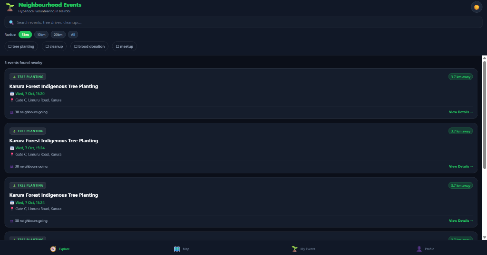
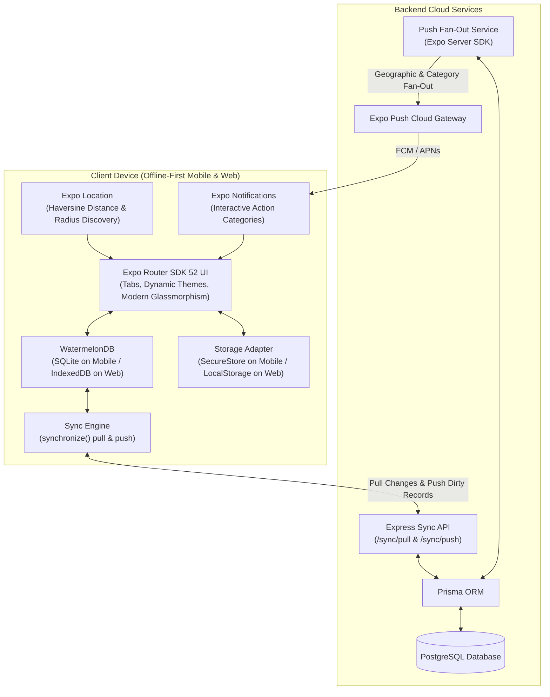

# 🌱 Neighbourhood Events

<p align="center">
  <b>Hyperlocal Community Events & Volunteer Finder for Nairobi</b><br>
  <i>Discover tree-planting drives, blood donation clinics, river cleanups, and neighbourhood meetups with offline-first persistence, location-based discovery, and dark mode.</i>
</p>

<p align="center">
  
  
  
  
  
  
  
  
</p>

---

## 📸 App Preview

<p align="center">
  
</p>
<p align="center"><i>Explore screen featuring Obsidian Dark Mode, search, dynamic radius pills, category chips, and live hyperlocal Nairobi event listings.</i></p>

---

## ✨ Key Highlights

- ⚡ **Offline-First by Design**: WatermelonDB is the local source of truth on device (SQLite for Native, IndexedDB LokiJS for Web). Browse and RSVP even deep in Karura Forest or Ngong Hills without cell signal.
- 🌙 **Adaptive Obsidian Dark Mode**: High-contrast, accessibility-tested dark mode (`#0B0F19`) and clean light mode with dynamic system preference detection and one-tap toggles.
- 📍 **Hyperlocal Geolocation Discovery**: GPS-based distance calculations powered by the Haversine formula with radius filtering (`5 km`, `10 km`, `20 km`, `All`).
- 🔔 **Targeted Push Notifications**: Device token registration with radius-based geographic fan-out and interactive category actions via the Expo Push Gateway.
- 🔄 **Reliable Bi-Directional Sync**: WatermelonDB `synchronize()` integration querying `/sync/pull` and `/sync/push` with automatic offline mutation queuing.
- 🌐 **Cross-Platform Compatibility**: Fully functional across Android, iOS, and Web (zero crash fallbacks, split platform adapters for storage and maps).
- 🌲 **Seeded Nairobi Initiatives**: Pre-populated with 12 real-world initiatives across Karura Forest, Michuki Park, Sarit Centre, KNBTS, Nairobi Arboretum, KNH, and Kilimani.

---

## 🏛 Architecture Overview



---

## 🧩 Event Categories

| Icon | Category | Focus |
|:---:|:---|:---|
| 🌱 | **Tree Planting** | Reforestation initiatives at Karura Forest, Ngong Hills, and Nairobi Arboretum |
| 🧹 | **River & Beach Cleanup** | Plastic cleanup sweeps along the Nairobi & Mathare Rivers and Michuki Park |
| 🩸 | **Blood Donation** | Urgent community drives with KNBTS, Sarit Centre, and Kenyatta National Hospital |
| 🤝 | **Neighbourhood Meetup** | Community gardening, urban farming workshops, and eco-security town halls |

---

## 🛠 Tech Stack

### Mobile & Web Frontend
- **Framework**: [Expo SDK 52](https://expo.dev/) with [Expo Router](https://docs.expo.dev/router/introduction/) (File-based navigation)
- **State & Database**: [@nozbe/watermelondb](https://watermelondb.dev/) (Offline-first SQLite on Native, IndexedDB LokiJS on Web)
- **Design & Theming**: Custom Design System with `ThemeContext` supporting Dark & Light modes
- **Location**: `expo-location` with custom Haversine distance utility
- **Notifications**: `expo-notifications` with custom categories
- **Maps**: `react-native-maps` for iOS/Android, interactive Web map fallback

### Backend & Database
- **Runtime**: Node.js & TypeScript
- **Framework**: Express.js
- **Database**: PostgreSQL with [Prisma ORM](https://www.prisma.io/)
- **Push Service**: `expo-server-sdk`
- **Testing**: Jest + Supertest

---

## 🚀 Quick Start Guide

### Prerequisites
- Node.js ≥ 20.x
- npm ≥ 10.x
- Docker & Docker Compose (optional for local PostgreSQL)

---

### 1. Backend Setup

```bash
# 1. Navigate to backend directory
cd backend

# 2. Install backend dependencies
npm install

# 3. Create .env from template
cp .env.example .env

# 4. Start PostgreSQL database via Docker (from repository root)
cd ..
docker-compose up -d postgres

# 5. Push Prisma schema & start backend
cd backend
npx prisma db push
npm run dev
```

*The backend server will run on `http://localhost:4000`.*

---

### 2. Client Setup

```bash
# 1. From repository root, install dependencies
npm install

# 2. Create client environment file
cp .env.example .env

# 3. Launch Expo Development Server
npm start
```

- Press **`w`** in the terminal to launch directly in your browser.
- Press **`a`** to open on a connected Android device or emulator.
- Press **`i`** to open on iOS simulator.

---

## 🧪 Testing & Code Quality

Both frontend and backend are covered by comprehensive automated test suites:

```bash
# Run frontend unit & component tests (Jest)
npm test

# Run frontend TypeScript typecheck
npm run typecheck

# Run backend test suite (/sync pull & push protocol)
cd backend && npm test
```

---

## 📦 Standalone Android APK Build (EAS Build)

The project includes an optimized [eas.json](file:///c:/Users/crnji/Videos/Projects/Mazingira-App/eas.json) configured to generate standalone `.apk` binaries directly:

```bash
# Install EAS CLI
npm install -g eas-cli

# Authenticate with Expo
eas login

# Build standalone Android APK
eas build --platform android --profile preview
```

---

## 📁 Repository Structure

```
Neighbourhood-Events/
├── app/                        # Expo Router file-based screens
│   ├── (tabs)/                 # Bottom tab navigator (Discover, Map, My Events, Profile)
│   │   ├── index.tsx           # Discover Feed with search, filters & theme toggle
│   │   ├── map.tsx             # Interactive GPS location map
│   │   ├── my-events.tsx       # Saved RSVPs & attendance tracker
│   │   └── profile.tsx         # User preferences, dark mode & sync controls
│   ├── event/[id].tsx          # Event details & interactive RSVP screen
│   └── _layout.tsx             # Root layout with ThemeProvider & DB seed
├── backend/                    # Express + Prisma + PostgreSQL Sync Backend
│   ├── prisma/schema.prisma    # PostgreSQL database schema
│   ├── src/
│   │   ├── routes/             # REST endpoints (auth, events, rsvp, sync, notifications)
│   │   ├── services/           # Sync protocol & Expo push fan-out services
│   │   └── index.ts            # Express server entry point
│   └── Dockerfile              # Production container build
├── docs/
│   └── screenshots/            # App screenshots & visual assets
├── src/
│   ├── components/             # UI components (EventCard, CategoryFilter, DistanceBadge, etc.)
│   ├── context/ThemeContext.tsx# Light/Dark Theme provider & tokens
│   ├── data/seedEvents.ts      # 12 Initial Nairobi hyperlocal events
│   ├── db/                     # WatermelonDB models, schema, & platform adapters
│   ├── hooks/                  # Custom hooks (useEvents, useLocation, useSync)
│   └── services/               # API, storage, auth & notification services
├── docker-compose.yml          # Local PostgreSQL container service
├── eas.json                    # EAS build configuration for Android APK
└── package.json                # Frontend package dependencies & scripts
```

---

## 🤝 Contributing

Contributions are warmly welcomed! To contribute:
1. Fork the repository
2. Create your feature branch (`git checkout -b feature/amazing-feature`)
3. Commit your changes (`git commit -m 'feat: add amazing feature'`)
4. Push to the branch (`git push origin feature/amazing-feature`)
5. Open a Pull Request

---

## 📄 License

Distributed under the MIT License. See [LICENSE](file:///c:/Users/crnji/Videos/Projects/Mazingira-App/LICENSE) for more information.
